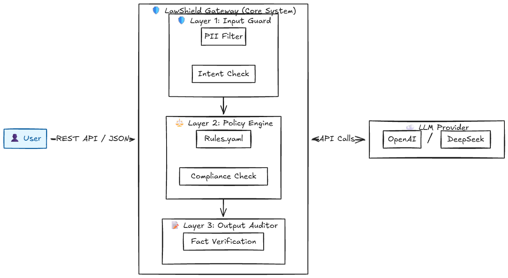

# 🛡️ LawShield-CN (律盾) Demo 

> **Enterprise-Grade AI Governance Gateway for China Compliance**
> 
> 策略驱动的中国法律合规 AI 网关 | 架构师级 LLM 护栏中间件

 

## 📖 Introduction

**LawShield-CN** 是一个采用 **Sidecar（旁路）模式** 设计的 AI 治理网关。旨在解决企业落地 RAG/LLM 应用时的**法律合规（Compliance）**与**数据安全（Security）**痛点。

它不像传统的敏感词过滤，而是基于**“策略即代码”(Policy as Code)** 理念，允许企业通过 YAML 配置动态加载法律规则，实现业务逻辑与合规风控的彻底解耦。

## 🏗 Core Architecture (核心架构)

本项目采用微内核管道架构，请求流转路径如下：

1.  **Input Guard (入口卫士)**: 
    * 对用户 Prompt 进行 PII (个人隐私) 实时脱敏。
    * 拦截“诱导性提问”与非法意图（如洗钱、逃税咨询）。
2.  **Policy Engine (策略引擎)**: 
    * 加载 `config/rules.yaml`，基于中国法律法规（如《广告法》、《生成式 AI 管理暂行办法》）进行语义匹配。
3.  **LLM Router**: 
    * 安全透传至 DeepSeek/OpenAI 等大模型。
4.  **Output Auditor (出口审计)**: 
    * 校验 AI 生成内容的法条真实性，防止法律幻觉 (Legal Hallucination)。

## 🚀 Quick Start

```bash
# 1. Clone repo
git clone [https://github.com/yourname/LawShield-CN.git](https://github.com/yourname/LawShield-CN.git)

# 2. Install dependencies
pip install -r requirements.txt

# 3. Run Gateway
python main.py

